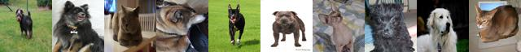
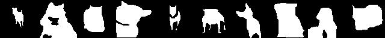

# Image Segmentation

A common data source and loader will be used in this tutorial between PyTorch and TensorFlow. Run the `data.py` first to download the data from the Oxford-IIIT Pet Dataset.

```bash
conda activate comp0197-tf  # or comp0197-pt
python data.py
```

Once download completes, in the Python console, example images and segmentation labels can be saved for visualisation.
```python
import numpy as np
from PIL import Image
from loader import H5ImageLoader

DATA_PATH = './data'

images,labels = next(iter(H5ImageLoader(DATA_PATH+'/images_train.h5', 10, DATA_PATH+'/labels_train.h5')))
image_montage = Image.fromarray(np.concatenate([images[i] for i in range(len(images))],axis=1))
image_montage.save("train_images.jpg")
label_montage = Image.fromarray(np.concatenate([labels[i] for i in range(len(labels))],axis=1))
label_montage.save("train_labels.jpg")
```


