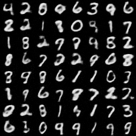

# Variational autoencoder

The [MNIST dataset](http://yann.lecun.com/exdb/mnist/) is small enough to fit in the memory on most modern computers. Both [TensorFlow Keras](https://www.tensorflow.org/api_docs/python/tf/keras/datasets/mnist) and [PyTorch Torchvision](https://pytorch.org/vision/stable/datasets.html#mnist) have facilities to work with the MNIST dataset. 

